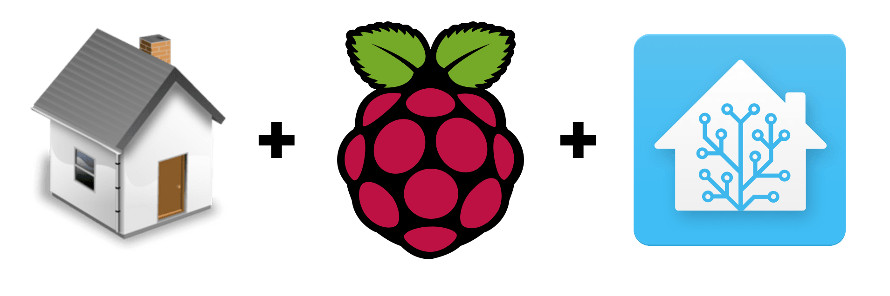
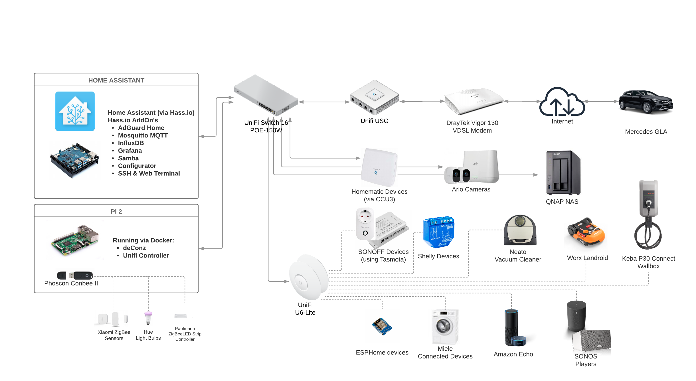

# JaMa Villa Home Assistant Configuration

![Project Maintenance][maintenance-shield]
[![Home Assistant][home-assistant-shield]](home-assistant)
[![License][license-shield]](LICENSE)

[![Circle CI][circleci-shield]][circleci]
[![GitHub Activity][commits-shield]][commits]
[![GitHub Last Commit][last-commit-shield]][commits]

[![Twitter][twitter-badge]][twitter]

Here's our JaMa Villa Home Assistant configuration, running our home
automation. [Home Assistant][home-assistant] (HA) is an open-source home
automation platform which allows you to control devices easily, track multiple
sensors and integrate with a wide variety of commercial & DIY solutions.
I currently run it via [Hass.io](https://www.home-assistant.io/hassio/) on
a single Raspberry Pi. My HA configuration structure is heavily inspired by
the work done by [Franck Nijhof](https://github.com/frenck)

I try regularly update my configuration files, there is always something to
tweak or improve 😉. This repository is to inspire others, be free to use the
code from this repo for your own HA setup. If you think it is helpful and like
anything here, Be sure to 🌟 the GitHub repo.

## System Overview

## House Automation Hardware

### Host System

My Home Assistant system currently runs on a Raspberry PI 3 with 16GByte SanDisk Extrem MicroSD card. All is managed by hass.io and the following add-ons are currently used:

- [AdGuard Home](https://github.com/hassio-addons/addon-adguard-home)
- [Configurator](https://home-assistant.io/addons/configurator) - would
  like to use the VSC add-on but that is not available on Raspberry PI
- [Grafana](https://github.com/hassio-addons/addon-grafana)
- [InfluxDB](https://github.com/hassio-addons/addon-influxdb)
- [Log Viewer](https://github.com/hassio-addons/addon-log-viewer)
- [Mosquitto MQTT broker](https://home-assistant.io/addons/mosquitto/)
- [SSH & Web Terminal](https://github.com/hassio-addons/addon-ssh)
- [Samba share](https://home-assistant.io/addons/samba/)

#### Hubs

| Device                                        |                          Home Assistant                          | Notes                                       |
| --------------------------------------------- | :--------------------------------------------------------------: | ------------------------------------------- |
| [Homematic CCU3](https://amzn.to/2HyzEBK)     | [Homematic](https://www.home-assistant.io/components/homematic/) | Used to control all Homematic devices      |
| [deCONZ Conbee II](https://amzn.to/2A73E3I)   |    [deCONZ](https://www.home-assistant.io/components/deconz/)    | The main ZigBee Hub                         |
| [Arlo Hub](https://amzn.to/2Qf3D8S)           | [Aarlo](https://github.com/twrecked/hass-aarlo) custom component | Arlo camera system integration              |

#### Network

| Device                                                                            | Quantity | Home Assistant                                                    | Notes                                   |
| --------------------------------------------------------------------------------- | :------: | ----------------------------------------------------------------- | --------------------------------------- |
| [Ubiquiti Networks UniFi Switch - 16 Ports (US-16-150W)](https://amzn.to/2LqnXPQ) |    1     | [Ubiquiti Unifi](https://www.home-assistant.io/components/unifi/) | Primary network switch                  |
| [Ubiquiti Networks Unifi AP Lite (UAP-AC-LITE)](https://amzn.to/2Q7fbL5)          |    2     | [Ubiquiti Unifi](https://www.home-assistant.io/components/unifi/) | Wireless Access Point for interior use. |
| [Ubiquiti Unifi Security Gateway (USG)](https://amzn.to/2AbZc3K)                  |    1     | [Ubiquiti Unifi](https://www.home-assistant.io/components/unifi/) | Main router & firewall device           |
| [Draytek Vigor 130 ADSL/VDSL modem](https://amzn.to/2NJI4Kv)                      |    1     | n/a                                                               | The connection to the outside world     |

On network gear we are all-in for Unifi devices, they provide a reliable and stable network for our house. The Draytek modem is connected to the DSL line of the internet provider. The Unifi network equipment is also used as one of the primary presence detection methods.

#### Lighting

| Device                                                                     | Quantity |                              Home Assistant                              | Notes                                      |
| -------------------------------------------------------------------------- | :------: | :----------------------------------------------------------------------: | ------------------------------------------ |
| [Philips Hue White and Color Ambiance](https://amzn.to/2ZAoV50)            |    3     | [Philips Hue Light](https://www.home-assistant.io/components/light.hue/) | Color-changing smart bulbs                 |
| [Philips Hue White and Color Ambiance LightStrip](https://amzn.to/2zUd3LJ) |    2     | [Philips Hue Light](https://www.home-assistant.io/components/light.hue/) | Ambiante lights in kitchen and for TV wall |
| [Paulman RGBW Controller ZigBee](https://amzn.to/2ZP2V1A)                  |    1     |  [deCONZ Light](https://www.home-assistant.io/components/deconz/#light)  | Driver for old reused classic LED strip |
| [Sonoff S20 Smart Socket](https://amzn.to/2Znqe7f)                         |    9     |  [MQTT Switch](https://www.home-assistant.io/components/switch.mqtt/)   | The main Christmas season light driver |

#### Outlets & Switches

| Device                                                                                                             | Quantity |                             Home Assistant                              | Notes                                                               |
| ------------------------------------------------------------------------------------------------------------------ | :------: | :---------------------------------------------------------------------: | ------------------------------------------------------------------- |
| [Wireless Switch Actuator 1-channel with power metering (HM-ES-PMSw1-Pl-DN-R1)](https://amzn.to/2ZqGkwZ)           |    3     | [Homematic Switch](https://www.home-assistant.io/components/homematic/) | Indoor outlet for selected devices, mainly for power metering       |
| [Wireless Switch Actuator 1-channel, flush-mount (HM-LC-Sw1-FM)](https://amzn.to/2L7z2p2)                          |    1     | [Homematic Switch](https://www.home-assistant.io/components/homematic/) | Hallway light switch                                                |
| [Wireless Switch Actuator 1-channel, DIN-rail mount (HM-LC-Sw1-DR)](https://amzn.to/2L8Jv3p)                       |    4     | [Homematic Switch](https://www.home-assistant.io/components/homematic/) | Used to control outdoor                                             |
| [Wireless Switch Actuator 2-channel with power metering, DIN-rail mount (HM-ES-PMSw1-DR)](https://amzn.to/2NMf2tA) |    4     | [Homematic Switch](https://www.home-assistant.io/components/homematic/) | Used to control pumps of the pool and water tank                    |
| [Wireless Switch Actuator 4-channel, DIN-rail mount (HM-LC-Sw4-DR)](https://amzn.to/2ZrPUPZ)                       |    1     | [Homematic Switch](https://www.home-assistant.io/components/homematic/) | Used to control outdoor and pool lighting                           |
| [Sonoff S20 Smart Socket](https://amzn.to/2Znqe7f)                                                                 |    11    |  [MQTT Switch](https://www.home-assistant.io/components/switch.mqtt/)   | The main Christmas season light driver                              |
| [Sonoff 4CH Pro R2](https://amzn.to/2LbEIhT)                                                                       |    1     |  [MQTT Switch](https://www.home-assistant.io/components/switch.mqtt/)   | Used to control outdoor garden low power lighting                   |
| [Sonoff TH16](https://amzn.to/2L8EVlF)                                                                             |    1     |  [MQTT Switch](https://www.home-assistant.io/components/switch.mqtt/)   | Carport light and outdoor temperature & humidity with Si7021 sensor |

Switches and outlets are used in various capacities, most are for lighting and some are for pool & pump devices. For devices consuming more energy I prefer the Homematic devices, they give a good and secure overall impression. For seasonal Christmas lighting (most are low power LEDs) I mainly use Sonoff outlets.

#### Sensors

| Device                                                                                | Quantity |                              Home Assistant                              | Notes                                               |
| ------------------------------------------------------------------------------------- | :------: | :----------------------------------------------------------------------: | --------------------------------------------------- |
| [Wireless Differential Temperature Sensor (HM-WDS30-OT2-SM)](https://amzn.to/2PnlppL) |    2     | [Homematic Sensor](https://www.home-assistant.io/components/homematic/)  | Pool & solar temperature sensor for pool automation |
| [Xiaomi Aqara Smart Temperature Humidity Sensor](https://amzn.to/2ZqKXac)             |    6     | [deCONZ Sensor](https://www.home-assistant.io/components/deconz/#sensor) | Main indoor temperature & humidity sensor           |
| [Xiaomi Aqara Smart Vibration Sensor](https://amzn.to/2zwhQCX)                        |    2     | [deCONZ Sensor](https://www.home-assistant.io/components/deconz/#sensor) | Moving detection of our garden bench ;-)            |
| [Sonoff TH16](https://amzn.to/2L8EVlF) with Si7021 sensor                             |    1     |   [MQTT Sensor](https://www.home-assistant.io/integrations/sensor.mqtt/)   | Garden & outdoor temperature & humidity sensor      |

| [luftdaten.info](https://luftdaten.info/) air quality sensor                         |    1     |   [REST Sensor](https://www.home-assistant.io/integrations/rest/)   | DYI Fine dust & air quality sensor based on SDS011 board with additional BME280 sensor to measure temperature & air pressure and humidity |

Most of the sensor got replaced with Xiaomi Aqara devices recently, they are small and very reliable, connected via ZigBee deCONZ. Unfortunately, they are only for indoor use, so I keep the Homematic HM-WDS30-OT2-SM for outdoor.

#### Security

| Device                                                                       | Quantity |                                 Home Assistant                                 | Notes                                                                        |
| ---------------------------------------------------------------------------- | :------: | :----------------------------------------------------------------------------: | ---------------------------------------------------------------------------- |
| [Wireless Door/Window Sensor, optical (HM-Sec-SCo)](https://www.eq-3.com/products/homematic/detail/homematic-wireless-door-window-sensor-optical.html) |    9     | [Homematic Binary Sensor](https://www.home-assistant.io/components/homematic/) | Door sensors to detect if windows & exterior doors have been opened / closed |
| [Wireless Shutter Contact (HM-Sec-SC-2)](https://www.eq-3.com/products/homematic/detail/homematic-wireless-window-sensor.html)            |    1     | [Homematic Binary Sensor](https://www.home-assistant.io/components/homematic/) | Door sensors to detect if windows have been opened / closed |
| [Wireless Motion Detector (HM-Sec-MDIR-3)](https://www.eq-3.com/products/homematic/detail/homematic-wireless-motion-detector-indoor.html)          |    3     | [Homematic Binary Sensor](https://www.home-assistant.io/components/homematic/) | Indoor motion detection |
| [Wireless Siren (HM-Sec-Sir-WM)](https://www.eq-3.com/products/homematic/detail/homematic-wireless-siren-with-signal-light.html)                    |    2     |    [Homematic Switch](https://www.home-assistant.io/components/homematic/)     | Indoor alarm siren |
| [Rademacher DuoFern Motor Actuator 9471-1](https://www.rademacher.de/en/smart-home/produkte/rohrmotor-aktor-9471-1?productID=35140662) |    9    |       [pyduofern](https://github.com/gluap/pyduofern) (custom component)       | Flush-mounted actuator for roller shutter motors |

#### Media & Voice Assistant

| Device                                     | Quantity |                            Home Assistant                             | Notes                                                     |
| ------------------------------------------ | :------: | :-------------------------------------------------------------------: | --------------------------------------------------------- |
| [Sonos Play:3](https://www.sonos.com/en-us/home)    |    1    | [Sonos](https://www.home-assistant.io/components/media_player.sonos/) | Our main music system in the house and Home Assistant TTS |
| [Sonos Move](https://www.sonos.com/en-us/shop/move.html)    |    1     | [Sonos](https://www.home-assistant.io/components/media_player.sonos/) | Still the 1st generation one 😞, get the new one          |
| [Sonos PlayBar](https://www.sonos.com/en-us/shop/playbar.html)   |    1     | [Sonos](https://www.home-assistant.io/components/media_player.sonos/) | TV sound                                                  |
| [Sonos Sub](https://www.sonos.com/en-us/shop/sub.html)       |    1     | [Sonos](https://www.home-assistant.io/components/media_player.sonos/) | TV sound                                                  |
| [Amazon Echo](https://amzn.to/2HM0XIW)     |    1     |         Via [Nabu Casa](https://www.home-assistant.io/cloud/)         | Voice control                                             |

#### Cameras

| Device                                | Quantity |                 Home Assistant                  | Notes                                                 |
| ------------------------------------- | :------: | :---------------------------------------------: | ----------------------------------------------------- |
| [Arlo HD](https://www.arlo.com/)    |    3     | [Aarlo](https://github.com/twrecked/hass-aarlo) | Started with these, then added Arlo Pro 2 later       |
| [Arlo Pro 2](https://www.arlo.com/) |    2     | [Aarlo](https://github.com/twrecked/hass-aarlo) | Definitely much better quality then the 1st generation |

The main argument for us to choose Arlo cameras were they are powered
via a battery since we have them placed mainly in places without power supply.
They only record if motion (or sound on the Arlo Pro 2) is detected.
The original Arlo HD requires special batteries and last ~6 months on one set.
The Arlo Pro 2 comes with a rechargeable battery pack or can be operated
with USB power supply.

#### Vacuum

| Device                                       |                          Home Assistant                           | Notes                          |
| -------------------------------------------- | :---------------------------------------------------------------: | ------------------------------ |
| [Neato Botvac D7](https://neatorobotics.com/) | [Neato](https://www.home-assistant.io/integrations/neato/) | Not much to say, does the job. |

#### Mailbox

| Device                                | Quantity |                 Home Assistant                  | Notes                                                 |
| ------------------------------------- | :------: | :---------------------------------------------: | ----------------------------------------------------- |
| [Xiaomi Aqara Window Door Sensor](https://xiaomi-mi.com/sockets-and-sensors/xiaomi-aqara-window-door-sensor/)    |    2     | [deCONZ](https://www.home-assistant.io/components/deconz/) | Detect opening of the mailbox flap or door |

#### Garden

| Device                                     |                     Home Assistant                     | Notes                                                                                                        |
| ------------------------------------------ | :----------------------------------------------------: | ------------------------------------------------------------------------------------------------------------ |
| [Worx Landroid S](https://worx-europe.com/) | [MQTT](https://www.home-assistant.io/components/mqtt/) | This little guy is integrated via [Landroid Bridge](https://github.com/virtualzone/landroid-bridge) and MQTT |

There is no direct integration of Landroid lawn mowers with Home Assistant yet, but the [Landroid Bridge](https://github.com/virtualzone/landroid-bridge) does a pretty good job. Landroid Bridge runs on a Raspberry Pi 3 in Docker container. It gets the lawn mover updates from the cloud and pushes them to Home Assistant via MQTT.

[home-assistant]: https://home-assistant.io
[issue]: https://github.com/mhaack/home-assistant-config/issues
[home-assistant-shield]: https://img.shields.io/badge/Home%20Assistant-0.108.x-blue
[license-shield]: https://img.shields.io/github/license/mhaack/home-assistant-config.svg
[maintenance-shield]: https://img.shields.io/maintenance/yes/2019.svg
[circleci-shield]: https://img.shields.io/circleci/project/github/mhaack/home-assistant-config/master.svg
[circleci]: https://circleci.com/gh/mhaack/workflows/home-assistant-config
[commits]: https://github.com/mhaack/home-assistant-config/commits/master
[commits-shield]: https://img.shields.io/github/commit-activity/m/mhaack/home-assistant-config.svg
[last-commit-shield]: https://img.shields.io/github/last-commit/mhaack/home-assistant-config.svg
[twitter]: http://twitter.com/mhaack
[twitter-badge]: https://img.shields.io/twitter/follow/mhaack.svg?style=social
